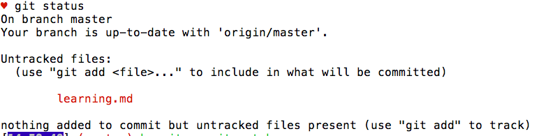
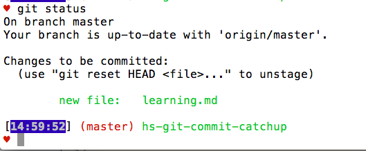

### Putting Code Online
 So you finish a lab, and then you accidentally spill Coke all over your laptop and fry it. It's the modern-day version of "my dog ate my homework." Good thing the tech industry's got your back thanks to version control with Git and GitHub.

So far, you've been using GitHub to pull labs from github.com and download them to your computer to work on. The real power of GitHub comes through doing the exact opposite: creating a project locally (or on your own computer) then saving your code remotely (or in the cloud).

### What is Version Control?
Let's say you're working on an application. You save your work at 5pm. Then you add a couple features and save again at 5:15pm. Then you make another edit and save at 5:30pm. But you realize that 5:30pm save was a huge mistake because you accidentally deleted an important chunk of code. If only you could go back to that 5:15pm version! If you're using **version control** with Git, you can! **Version control** is the process of storing multiple versions of a single project, allowing each version to be recalled at a later date. **Git** is a program that allows you to 

###What is Git?
> “The past is never where you think you left it.” — [Katherine Anne Porter](http://en.wikipedia.org/wiki/Katherine_Anne_Porter)

First of all, it’s important to note that Git and GitHub aren’t the same thing. **GitHub** _is a popular remote repository hosting service_. It's where we save our code in the cloud. **Git** _is a version control system that lives on your computer_. Git and Github integrate seamlessly together.

###Git with Github
Let's say you work on a lab and get half of the tests passing, but then you have to go home for the day. There's a risk you could drop your laptop in the Hudson River on the way home and you'd lose all your work. Besides emailing it to yourself, which is incredibly tedious, how could you easily save your code?

The best way to save your work it to put it on Github in a repository. So how do we get it there?

Go ahead and fork this repository. (Head to the top of this page, click the fork icon, fork this lab in Github and then clone it down).
Once you're inside the directory of this lesson, go ahead and make a new file called `learning.md`. In the file, type "Hello world!" save the your changes.

Now, in terminal in the directory of this lesson, enter `git status`. You should see something like this:

Git is telling us that we have added a file to our directory, but it also says our changes haven't been tracked yet. Git is smart enough to know we've added a file, but this file and the contents of the file aren't yet set to head up to the cloud.

We have to individually add files to Git by entering in terminal `git add name_of_file`. In this case, we'd type `git add learning.md`. We don't get any feedback from git, which means our file was successfully added. If we type `git status` again, we see:

Now we see the line `Changes to be committed:`. So far all we've done is added a file, which is like telling Git, yes please keep track of these specific changes. In order to actually save the changes, we have to commit them. A commit is like taking a snapshot of your entire codebase at a moment in time. Commiting often is a really great workflow because you can always rewind in time to different snapshots if you ever break your down the road.

To commit, we type `git commit -m "enter a message here`. The `-m` stands for message, which is what gets passed in quotation marks. This is a commit message. A commit message is a description of the work that you've done that accompanies the snapshot. Commit messages are really helpful because future you can look at the messages and understand exactly what work you did on your code.

Once you enter your commit, you should see `On branch master Your branch is up-to-date with 'origin/master'.` This means your changes have been succesfully committed and a snapshot of your code was taken.

So now it's time to put your code on Github. We have to push the code up there with `git push`. Which actually sends the code to Github. Now, if you go to Github in the browser to this repository and refresh the page, you should see `learning.md` up there!

So heres's a summary of that workflow:

* git add file_name
* git commit -m "commit message"
* git push
